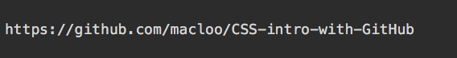
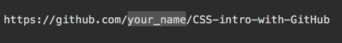
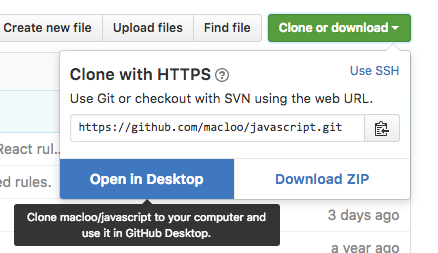

# Start working with CSS

This is a GitHub repo for a first assignment with CSS.

Before you can play, you need to learn some things about GitHub. Do you see the folder above named *github_basics*? Go into that folder, follow all the instructions there, and then come back.

## Forking a repo

You're back? Good. With your GitHub account and your app set up, you can now make a copy of this repo for yourself. Make sure you're signed in.

A repo can contain lots of files and folders, or few, or none (that would be an empty repo). Each GitHub user can have unlimited repos. As many as you want.

Find the button that says “Fork” (near the top of the page, right side). WAIT BEFORE YOU CLICK IT. This makes a new, independent copy of this entire repo under YOUR GitHub username. Yes, THIS repo. You will have your own copy. As soon as you click “Fork,” you'll be on YOUR COPY. So scroll to find this text again after that happens.

Click “Fork” now.

**Fork:** Your repo (the copy) will not be changed when the original owner changes the original. Likewise, you can change your copy, and it will not affect the original. In most cases, you will only fork ONCE for one repo. (There is a way to update so that yours matches changes made to the original, but let’s leave that aside for now.)

The original URL:

The new URL will contain your username:

**After forking:** The repo does not exist on your computer YET.

## Cloning a repo

Find the button that says “**Clone or download**” (right side, below the Fork button). Click it.

Choose “Open in Desktop,” and your copy of the repo will appear in your app. If you are asked to “Launch Application,” do so, even if it’s already open.

 

You will be asked to choose a place on your hard drive for this repo. Put it inside the folder you already made inside Documents just for this purpose. (Perhaps you named it GitHub Projects?)

**Clone** uses your app (GitHub Desktop) to make a copy of the entire repo on your hard drive, and this copy is tethered to the version on the GitHub.com site (as you will see). You might clone a repo more than once, in some circumstances.

**NOTE:** Windows users, if you are getting an error message, or your clone is not working,
[please read this](http://babydatajournalism.tumblr.com/post/85108267252/github-for-windows-cant-clone-repo-stops-at-9).

## What you should have now

At GitHub.com, when you go to your user page/profile, you’ll see a link to your new repo (click it to view the repo). If you were on the **Repositories** tab, you'll need to reload the page to see the new repo.

On your hard drive, you’ll see a folder with the same name as that repo. (These two are tethered together, thanks to Git.) Where is that folder? It is where you told it to be saved, when you cloned it.

* You have a user page at GitHub. *My* user page is: https://github.com/macloo Yours will be similar, but with your username instead of *macloo*.
* The name of the repo you forked and cloned is: CSS-intro-with-GitHub-2016
* That is both the name of your new repo AND the folder name on your hard drive.
* **DO NOT change the folder name!**
* In the app, you will see all repos listed by name. Probably you only have one repo, so far. To see inside any local repo, click its name in the app.

## Next steps

To continue with your assignment, go into the folder above named *git_branches* and follow the instructions there.
