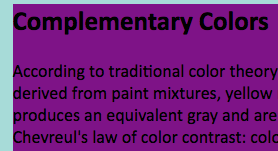
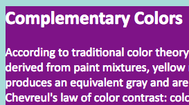

# Instructions for Assignment

Make sure you are in the *assignment-yourname* branch in your GitHub app.

If you don't understand that, you probably skipped a step. Not good. Go back and find out where you went off the track.

Up to now, you have done the following:

1. [Created a GitHub account and signed in.](../github_basics)
2. [Forked and cloned a repo.](../../../)
3. [Created a new branch named *assignment* and switched to that branch.](../git_branches)

## Save As: Two new files

In the *assignment* folder of this repo, you will open two files, *starter_file.html* and *first.css* (inside the *styles* folder).

Open those two files **in your text editor.**

* *starter_file.html*: Do a Save As and name it with your last name (my file would be *mcadams.html*). Make sure you save this new file into the same place (the *assignment* folder).

* *first.css* Do a Save As and name it with your last name (my file would be *mcadams.css*). Make sure you save that file inside the *styles* folder (which is inside the *assignment* folder).

* CLOSE *starter_file.html* and *first.css* -- you will not change those.

Please be very careful to follow those instructions exactly.

## Your HTML file

Imagine this file is part of a larger website called “Everything You Need to Know About Web Design.” That's the name of the entire site.

The “Color Theory” article is just one of many articles on the site. That's the main heading of the article on this page.

You will make ONLY these changes in the HTML file:

1. Change the `link` tag (in the `head`) to use your own renamed CSS file.
2. Add `article` tags where they make sense. Save and reload to see changes.
3. Add `header` tags where they make sense. (Think of the entire site as it was described above. What is the logic of the `header` element? It is not HEAD and it is not `h1`; the `header` element has a particular use.)
4. Add `footer` tags where they make sense.
5. Wrap the "Complementary Colors" heading and the two paragraphs below it in a single pair of `aside` tags (in other words: create one `aside` element that contains that heading and the two paragraphs).
6. At the bottom of the page, change the words YOUR NAME HERE to your real first and last name, with normal capitalization (not all uppercase).

All of those tags are covered in your textbook and also in the
["HTML Basics" videos on YouTube](https://www.youtube.com/playlist?list=PLZFU-W6LLeecJuSQh20QUU_gCmS30sLTB), parts 5 and 6. The videos will be be very helpful. If you misuse the tags, it will affect your grade.

## Your color palette

Create a color palette using the [Adobe Color](https://color.adobe.com/) site, [ColorPicker.com](http://www.colorpicker.com/), or another tool. You might enjoy [this resource](https://color.adobe.com/explore/most-popular/?time=all) -- choose Edit on any palette to get access to the hexadecimal codes.

**ALL colors in your stylesheet MUST use hexadecimal codes** (explained in chapter 13 and [this video](https://www.youtube.com/watch?v=iJcIlC4yFIQ&index=22&list=PLZFU-W6LLeecJuSQh20QUU_gCmS30sLTB)).

Your color palette must include four (4) colors that are not white, black or gray. Stay away from overly bright, garish colors. Choose colors that look good side-by-side. They can be shades or hues of one another.

## Your CSS file

Note that we have not yet covered fonts, margin, padding, and many other elements of CSS. Do not use what we have not covered. Keep your focus on the purposes of this assignment:

* Write an external CSS stylesheet.
* Use selectors correctly in writing CSS rules.
* Learn to use color in CSS declarations.
* Test and modify your style rules.

We also have not covered use of classes and IDs, so you will apply styles only to *element type selectors* such as `body`, `figure` and `article`.

The [video](https://www.youtube.com/playlist?list=PLZFU-W6LLeecJuSQh20QUU_gCmS30sLTB) for chapter 11 demonstrates how to start using CSS.  

**ALL styles must be in your external stylesheet file. NO styles can appear in the HTML file.**

### Backgrounds

You must have four colors in your palette (you choose which is color 1, 2, etc.). Style the following:

* Color 1: The background color of both `header` and `footer`. Same color for both.
* Color 2: The background color of `article`.
* Color 3: The background color of both `aside` and `body`. Same color for both.
* Color 4: The background color of `figure`.

After you save and reload in the browser, you might decide your palette needs some changes -- especially if the colors hurt your eyes! Feel free to change your four colors as you save and view the results in your browser. But do use *exactly four different colors* as listed above.

Note that the `body` and `article` selectors are already in the stylesheet. Edit or add to the existing declarations. Do not add another `body` or `article` rule! (Not sure what a *rule* is? Or a *declaration*? They are explained in chapter 11.)

### Text

When you are satisfied with those results, move on to the text color that is specified in `body`. For this assignment, use only `#fff` or `#000` for text color in `body`. Choose the one that is most readable onscreen, with good contrast.

After you specify the text color for `body`, reload the page and look at each part of the page. Is there any element in which the contrast is poor for text on background? If so, you must CHANGE the text color for that element to eliminate poor contrast.

Example: In my `aside`, I see that `#000` text on a `#7E1387` background is very hard to read. My stylesheet has this:

```
aside {
    background: #7E1387;
}
```



To change the text color only for `aside`, I will add one line:

```
aside {
    background: #7E1387;
    color: #fff;
}
```

Result:



Still not beautiful, but at least more readable.

### Pseudo classes

The link pseudo-class selectors (`a` elements) are covered in chapter 13.

Note that there are five (5) link pseudo classes, and there is a *required order* for putting them in your stylesheet.

Select colors for all five link pseudo classes that provide **good contrast** with the background color of `figure` -- most of the links on this page are in a `figure` element. Save, reload, and adjust as needed to get good contrast.

**ALL colors in your stylesheet MUST use hexadecimal codes** (explained in chapter 13 and [this video](https://www.youtube.com/watch?v=iJcIlC4yFIQ&index=22&list=PLZFU-W6LLeecJuSQh20QUU_gCmS30sLTB)).

Now look at your `footer`. Chances are the pseudo-class colors that worked for everything else are not providing a good color experience in your `footer`.

To fix that:

1. Copy the block of all five of your pseudo-class rules.
2. Paste that block below the five rules.
3. For each pseudo-class selector in the second set of five, add the word *footer* at the start.
4. Find and test new colors for the `footer` pseudo classes.

Original:

```
a:link { color: #3371ac; }
```

Footer version:

```
footer a:link { color: #c363b2; }
```

Save and reload often to test, test, test. If anything looks messed up, it is probably because of a typing error. Check your file carefully.

Don't worry about the edges of elements. The text is too close to the edges, and it looks ugly. Just live with it. You will learn how to fix this, using borders, margin and padding, soon enough!

Remember, the focus of this assignment is using CSS to apply color to specific elements. Mark up the HTML elements correctly and write the CSS for text and background colors correctly.

## Next steps

When you have tested everything and are satisfied with your HTML and CSS, save and close the two files in your text editor.

Then go back to the top of this repo, where all files and folders are listed. Go into the folder named *git_commit_and_sync* and follow the instructions there.

*(References to chapters 11 and 13 and “your textbook” mean [this book](http://shop.oreilly.com/product/0636920023494.do).)*
