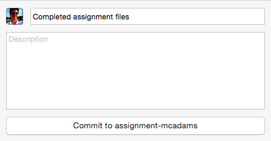

# Git Commit and Sync

Before following these instructions, your HTML and CSS files should be completely finished and ready for grading. Save them and close them.

Up to now, you have done the following:

1. [Created a GitHub account and signed in.](../github_basics)
2. [Forked and cloned a repo.](../../../)
3. [Created a new branch named *assignment-yourname* and switched to that branch.](../git_branches)
4. [Completed the assignment about CSS styles.](../assignment)

## Commit and commit messages

Before you can sync your local files (local repo) with GitHub (remote repo), you must **commit** your changes. Git requires this.

A commit is often described as a snapshot. The snapshot records what has changed in this project since your last commit. The list of all commits is a record of all the changes made to the project since it began.

The commit message is your description or explanation of those changes. These messages can be very helpful in collaborative projects. They might be less meaningful for small, solo projects -- but you have to write them anyway.

## How to commit

A good commit message for this case would be: “Completed assignment files.”

In the Changes window of the app, bottom left, type your commit message in the box that says “Summary.” You don't need a description. Click the button that says “Commit to assignment-yourname.” **Note:** *assignment-yourname* is the name of your branch. If this says “Commit to master,” you have not been working in the correct branch!

If you change anything in your files after this, you will need to commit again. Same procedure, but you should write a different message, such as “fixed color error” -- describe what you changed.

## How to sync

Do this **after you commit.** You can make many commits, or one, before you sync. In other words, you do not need to sync every time you commit.

In the app, you'll find a Sync button at the upper right. To sync, click the button.

**Note:** If you have not published this branch yet, the button will say “Publish,” not “Sync.” Click that.

By syncing, you will make your remote repo (at GitHub) match your local repo (on your hard drive), providing a backup for your work. By keeping local and remote repos synchronized, you can protect your work and also share it with other people.

Look at your repo on **github.com** and check to see that your files are there, in the *assignment-yourname* branch, in the *assignment* folder.

## Check the rubric

Make sure you have done everything listed in the [rubric](../rubric).

If so, submit the complete URL of your GitHub repo in Canvas.

If you need to change anything in your files: After changing and saving them in your text editor, re-follow the steps on this page to commit again and sync.

If you do not sync, I will NOT see your changes.
