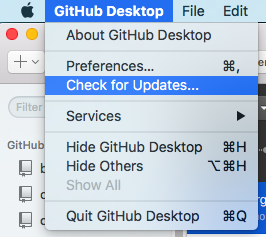

# GitHub Basics

These are your instructions for getting started with GitHub.

To learn why GitHub is important, you can read [What Exactly Is GitHub Anyway?](http://techcrunch.com/2012/07/14/what-exactly-is-github-anyway/) and/or [How GitHub Conquered Google, Microsoft, and Everyone Else](http://www.wired.com/2015/03/github-conquered-google-microsoft-everyone-else/). If you're not interested in why GitHub is important, then don't read them.

## What is a repo?

Right now you’re looking at a GitHub repo. “Repo” is short for “repository.” A repo is a place to store code. More important, it is a place to keep a record of all your changes. It’s also great for sharing and collaborating.

This repo is named “CSS-intro-with-GitHub-2016.” The name of any repo is at the top of the web page.

A repo usually contains several folders and files. Some repos contain dozens of folders and files -- maybe even hundreds.

## Sign up for GitHub

So you can play too, you need to get a GitHub account (if you don’t have one yet). There should be a “Sign Up” button at the top of this page (if you are not already signed in).

If you already have a GitHub account, use that one.

**Note:** Think about your username before you choose it. This is a professional space. Your username will be visible to strangers. Many people use their real first and last names.

GitHub is free unless you want some [special features](https://github.com/pricing) for collaboration. You will not need those for this class.

You can have only ONE GitHub account per email address.

A repo can be public or private. Your work for this course will all be public.

## Download the GitHub Desktop app

Download [GitHub Desktop](https://desktop.github.com/). Also free. If you downloaded this app before now, check to make sure you have the newest version.

I will refer to GitHub Desktop as “the app.”

Install the app. To see how, go to the Help section for the app: [Getting Started with GitHub Desktop](https://help.github.com/desktop/guides/getting-started/).

Using the same Help instructions as needed, LINK your GitHub account to the app. This is called “Authenticating to GitHub.” **Note:** You do not have 2FA or Enterprise.

You DID sign up for GitHub already -- yes?

## Get organized

Time for some thinking: GitHub expects things to be stable on your hard drive(s). That means you need to decide very deliberately WHERE on your hard drive a folder associated with GitHub will be. DO NOT associate GitHub with folders on your Desktop! Folders for your web projects must always be inside your Documents folder on your hard drive.

Go *inside* your Documents folder and make a **new folder** there. This ONE folder  will contain all other folders that you will associate with GitHub. You might name that folder Webwork, or Datawork, or Code, or some other general term. Name it something that makes sense to you. (I think it would be confusing to name it GitHub. Maybe naming it GitHub Projects would be okay.)

Your GitHub app is going to coordinate things for you between the web (GitHub) and your hard drive, but GitHub can’t think, and GitHub can’t figure out that you have moved a folder or changed its name. So plan ahead, and make a folder that will STAY PUT.

## Next steps

To get you started, we will **fork** and then **clone** a repo. (Those GitHub words will all be defined as we go along.)

**Go back to the top of this repo now,** and you’ll learn how. Instructions are there.

**To get back to the top of any repo,** find the link with the repo's name in the top left area of the web page (the page you are reading right now). Click the link!

Go to the top of this page now, find that link, and go back to where you started. Subheading: “Forking a repo.”
